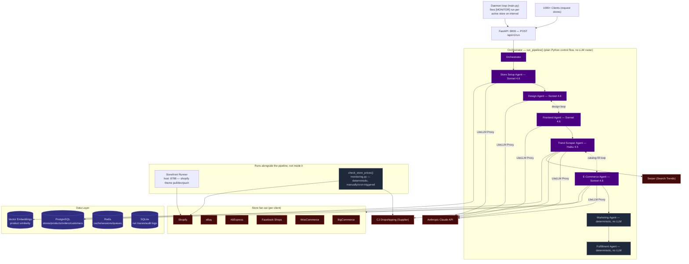
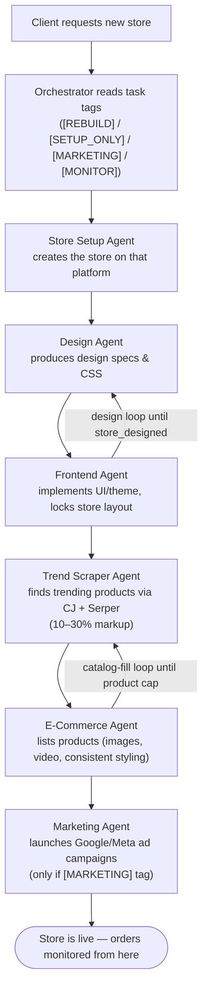
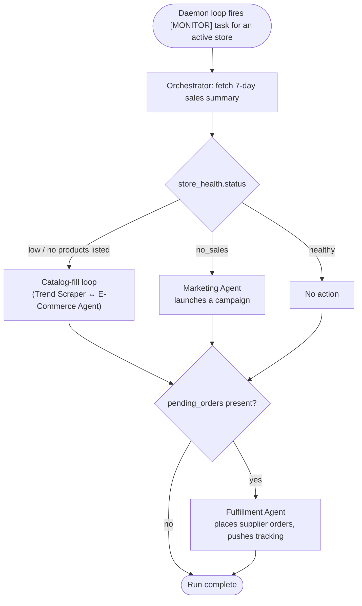
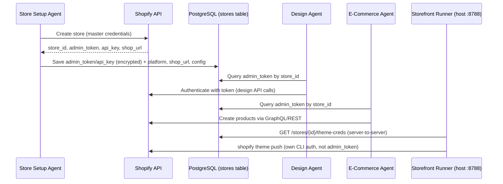

# Alpha Shoop — Architecture

Generated from [`docs/architecture.drawio`](architecture.drawio) (last edited 2026-06-24 — diagram content updated to match the orchestrator refactor; see "Notes" below for why the other three repo copies are still stale). Diagrams below are Mermaid (GitHub renders these natively); the same `system` diagram also lives, hand-synced, as `SYSTEM_MERMAID` in [`platform-app/src/pages/Architecture.tsx`](../platform-app/src/pages/Architecture.tsx) for the in-app viewer.

## 1. System Architecture

One orchestrator sequencing 7 worker steps in a fixed pipeline (no per-step LLM routing), fed by two external data sources (CJ Dropshipping for supply, Serper for trend search), serving many clients' stores across six commerce platforms, backed by a four-part data layer. The Storefront Runner and the price/stock monitor job are deliberately outside the pipeline — see diagrams 2–4.

## 2. New Store Creation Process Flow

A linear sequence triggered by a client request. The Orchestrator's tag check (`[REBUILD]` / `[SETUP_ONLY]` / `[MARKETING]` / `[MONITOR]`) is a plain conditional, not an LLM decision. Data is saved to PostgreSQL, Redis, and the embeddings store throughout. Estimated timing per stage: store setup 2–5 min, design+frontend 5–10 min, product loading 3–5 min, marketing setup 2–3 min — **~15–25 minutes total**.

## 3. Monitor / Maintenance Flow

Not in the original diagram set — added because the orchestrator's `is_monitor` branch (`src/agents/orchestrator.py`) is a second, equally real entry point, normally fired by the daemon loop in `src/main.py` rather than a client request.

This runs through the same `run_pipeline()` as store creation — it's the same orchestrator, just entered with an `[MONITOR]` task tag instead of a fresh build. It is separate from the `check_store_prices()` job in diagram 1, which re-checks CJ supplier prices/availability against already-listed products and reprices/delists in Shopify; that job has no LLM step at all and isn't triggered by the daemon loop — it's a standalone endpoint (`POST /stores/{id}/check-prices`).

## 4. Credentials & Permissions Flow

How a store's Shopify Admin token is created, stored, and reused:

Security notes called out on the diagram: tokens encrypted in DB, agents have read-only access to tokens (not write), tokens rotated periodically, all API calls audit-logged, different scopes per platform. The Frontend Agent does **not** touch `admin_token` for theme push — that goes through the Storefront Runner's own `shopify` CLI auth (see Notes).

## Notes — how this compares to the rest of the repo

- **Four copies of `architecture.drawio` exist** (`/architecture.drawio`, `/docs/architecture.drawio`, `/platform-app/public/architecture.drawio`, `/platform-app/dist/architecture.drawio`). `docs/architecture.drawio` is the source of truth; it and the root-level and `platform-app/public` copies were all synced on 2026-06-24 to drop the "Director Agent" box and the stale "Frontend Agent pushes theme via admin_token" claim — `platform-app/public/architecture.drawio` is what `platform-app/src/pages/Architecture.tsx`'s `DrawioViewer` actually fetches (`url="/architecture.drawio"`), so this is what users see in the app. Only `platform-app/dist/architecture.drawio` (a build artifact, regenerated by `make docs-build` i.e. `npm run build`) is still stale until the next build.
- **The "Director Agent" box no longer exists in code** (as of 2026-06-24, and now also no longer in this diagram). `src/agents/director.py` and `src/agents/graph.py` were deleted — the LLM-routed graph they implemented made an extra LLM call after every single step just to decide what ran next, and was the direct cause of a real bug (an infinite retry loop that burned ~1.5M tokens). It's replaced by `src/agents/orchestrator.py::run_pipeline()`, a single deterministic async generator that sequences the same 7 worker functions (Store Setup, Design, Frontend, Trend Scraper, E-Commerce, Marketing, Fulfillment — all unchanged) via plain Python control flow instead of an LLM router. See `.claude/commands/status.md`'s "Architecture: one orchestrator, not 7 routed agents" section for the full rationale.
- **Theme push no longer goes through the Frontend Agent with `admin_token`.** Per `CHANGELOG.md` ("Pivot storefronts to Shopify CLI Liquid themes"), theme management was deliberately moved into a manual flow: a human clicks "Run in localhost" / "Upload to Shopify" in `platform-app`'s Stores page, which drives the host **Storefront Runner** (`src/storefront/runner.py`, port 8788) using the official `shopify theme pull/dev/push` CLI, authenticated via the CLI's own flow rather than `admin_token`. The credentials diagram's step 4/5 boxes for theme push now reflect this.
- **`platform-app/src/pages/Architecture.tsx`'s hardcoded `SYSTEM_MERMAID`** was, until this pass, still describing the deleted `Director`/`LangGraph StateGraph` setup — updated alongside this file to show the orchestrator pipeline, the daemon loop, and the price/stock monitor job (diagram 1 above mirrors it).
- **The Monitor/Maintenance flow (diagram 3) and the price/stock monitor job (`src/mcp_tools/monitoring.py`, diagram 1) are both new as of this pass** — neither existed in the previous version of this doc. They're two different things despite the similar name: the Monitor flow runs through the LLM-driven orchestrator pipeline (fired by `main.py`'s daemon loop); the price/stock monitor is a plain deterministic CJ-recheck job behind `POST /stores/{id}/check-prices`, with no daemon trigger of its own.
