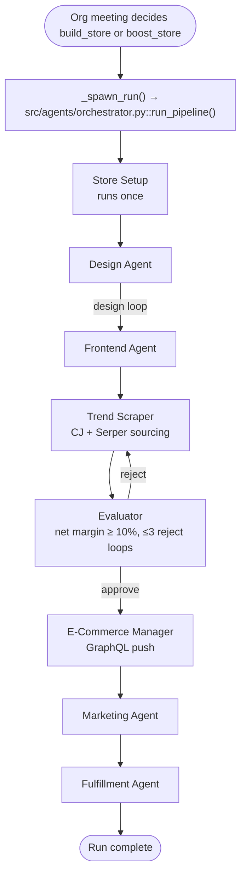
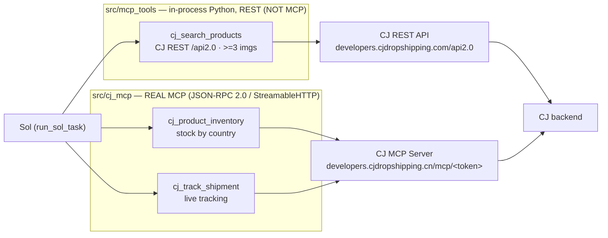
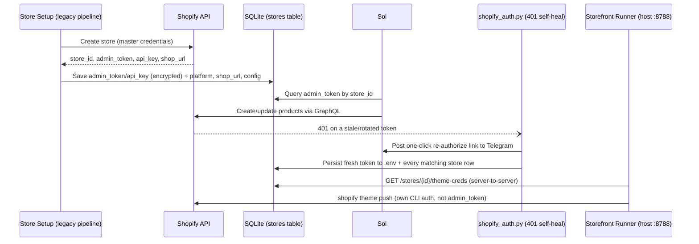

# Alpha Shoop — Architecture

**Rewritten 2026-08-13** to match the live system. The previous version of this
document described a 5-role LLM pipeline (Store Setup / Design / Frontend /
Trend Scraper / E-Commerce / Marketing / Fulfillment agents, sequenced by
`src/agents/orchestrator.py`) as the primary system. That pipeline **still
exists on disk and still runs** — but it is no longer what the company
actually is day to day. It's legacy plumbing underneath a newer layer.

**What the company actually is today**: a 6-agent **org** (`src/org/`) that
chats over **Telegram** (Slack was removed 2026-07-26) and acts on a
**60-second heartbeat loop**, not on a per-client "build me a store" request.
The old pipeline is only reached indirectly now, when the org's own CEO
meetings decide to `build_store`/`boost_store`. The same `system` diagram
below also lives, hand-synced, as `SYSTEM_MERMAID` in
[`platform-app/src/pages/Architecture.tsx`](../platform-app/src/pages/Architecture.tsx)
for the in-app viewer — keep the two in sync when either changes.

## 1. System Architecture

```mermaid
graph TB
    subgraph IN ["Interfaces"]
        direction LR
        TG["Telegram\nonly chat interface\n(replaced Slack)"]
        WH["Shopify webhooks\nHMAC SHA-256"]
        API["FastAPI :8000\n/org · /images · /videos ..."]
    end

    subgraph LOOPS ["main.py lifespan — 8 background loops"]
        direction LR
        HB["Heartbeat\nevery 60s"]
        ORGD["Org daemon\nevery 30s"]
        SUPL["Support-inbox poll\nevery 120s"]
        CEOR["CEO report\ndaily 21:00 Asia/Jerusalem"]
        MGR["Manager check-in\nevery 30min"]
        LEGD["Legacy single-store daemon\ndisabled by default"]
        IMGL["Reel image scan\ndisabled by default"]
    end

    subgraph ORG ["Org — 6 agents · org_agents / org_company tables"]
        direction LR
        AVA["Ava · CEO\nrouting · reports · meeting decisions"]
        SOL["Sol · sourcing & copy\nCJ search → Shopify push"]
        REEL["Reel · video\nlocal Wan2.2/ComfyUI pipeline"]
        NORA["Nora · support\ncentral Gmail inbox"]
        MILO["Milo · fulfillment\norder → CJ → tracking"]
        KAI["Kai · TikTok Ads\nread-only reporting"]
    end

    TG <--> ORG
    API --> ORG
    HB --> ORG
    ORGD --> ORG
    SUPL --> NORA
    CEOR --> AVA
    MGR --> AVA
    WH --> MILO

    ORG -->|"build_store / boost_store\nmeeting decisions"| PIPE
    subgraph PIPE ["Legacy pipeline — src/agents/orchestrator.py (still live, no longer client-facing)"]
        direction LR
        SS["store_setup"] --> DA["design"] --> FR["frontend"] --> TSN["trend_scraper"] --> EV["evaluator"] --> EM["ecommerce"] --> MA["marketing"] --> FA["fulfillment"]
    end
    LEGD -.->|"disabled by default"| PIPE

    subgraph TOOLS ["Per-agent tools"]
        direction LR
        CJREST["CJ REST\nsrc/mcp_tools — catalog search"]
        CJMCP["CJ real MCP\nsrc/cj_mcp — inventory + tracking"]
        SHOP["Shopify Admin\nGraphQL 2024-07"]
        TT["TikTok Ads real MCP\nsrc/tiktok_mcp — read-only"]
        GMAIL["Central Gmail inbox\nsend via Resend"]
        WAN["Local Wan2.2/ComfyUI\n+ TTS + ffmpeg"]
    end

    SOL --> CJREST & CJMCP & SHOP
    KAI --> TT
    NORA --> GMAIL
    MILO --> CJREST & SHOP
    REEL --> WAN
    PIPE --> SHOP
    IMGL --> REEL

    CJ["CJ Dropshipping"]
    SHOPADM["Shopify Admin API"]
    TIKTOK["TikTok Marketing API"]
    CJREST & CJMCP --> CJ
    SHOP --> SHOPADM
    TT --> TIKTOK

    subgraph LLM ["Model routing — src/llm/client.py, LiteLLM proxy"]
        direction LR
        LITELLM["get_llm(role)\nrole → LiteLLM model alias"]
        CLAUDE["Anthropic Claude\nCEO smart-tier, Sol fast-tier"]
        QWEN["Local qwen3\ndefault fallback for every role\nwhen ORG_LOCAL_LLM=1 or over budget"]
        LITELLM --> CLAUDE
        LITELLM --> QWEN
    end
    ORG --> LITELLM
    PIPE --> LITELLM

    subgraph GRAPH ["Knowledge graph — FalkorDB (Stage 1 of 3 built)"]
        direction LR
        FALKOR[("alpha_org graph\nAgent → CAN_USE → Tool\nAgent → EXECUTED → Tool\nAgent → ASSIGNED → Agent")]
    end
    ORG -.->|"best-effort, non-blocking"| FALKOR

    subgraph DATA ["Data layer — one shared data/traces.db"]
        direction LR
        SQLITE[("SQLite\norg_agents · org_meetings · org_company\nagent_runs · trace runs · product_mappings")]
        REDIS[("Redis\nRAG: CJ catalog + Sol's playbook")]
    end
    ORG --> SQLITE
    SOL --> REDIS

    subgraph SF ["Storefront — Shopify CLI Liquid themes"]
        direction LR
        DOCS["platform-app\nMy Stores"]
        RUNNER["Storefront Runner\nhost :8788"]
        THEMEDIR["Liquid themes\nstores/shopify/*"]
        CLI["shopify theme\npull · dev · push"]
        DOCS --> RUNNER --> CLI --> THEMEDIR
    end
    RUNNER -->|"/stores/{id}/theme-creds"| API
    CLI --> SHOPADM

    subgraph MON ["Daily CJ stock sweep — src/org/stock_watch.py, outside the org tick"]
        direction LR
        STOCKW["check_store_stock()\nfails closed · 2 consecutive zero-stock\nchecks before removal · cap 3/cycle"]
    end
    STOCKW --> CJ
    STOCKW --> SHOPADM

    classDef agent fill:#4B0082,stroke:#6d28d9,color:#e2e8f0
    classDef legacy fill:#292524,stroke:#57534e,color:#a8a29e
    classDef ext fill:#450a0a,stroke:#dc2626,color:#fee2e2
    classDef data fill:#312e81,stroke:#6366f1,color:#e0e7ff
    classDef llm fill:#1e3a5f,stroke:#2563eb,color:#e2e8f0
    classDef gw fill:#374151,stroke:#78716c,color:#d6d3d1
    classDef store fill:#065f46,stroke:#059669,color:#d1fae5
    classDef graph fill:#0b3d2e,stroke:#10b981,color:#d1fae5
    class AVA,SOL,REEL,NORA,MILO,KAI agent
    class SS,DA,FR,TSN,EV,EM,MA,FA,LEGD legacy
    class CJREST,CJMCP,SHOP,TT,GMAIL,WAN,CJ,SHOPADM,TIKTOK ext
    class SQLITE,REDIS data
    class LITELLM,CLAUDE,QWEN llm
    class TG,WH,API,HB,ORGD,SUPL,CEOR,MGR,IMGL gw
    class RUNNER,CLI,THEMEDIR,DOCS,STOCKW store
    class FALKOR graph
```

One org of six named agents, driven by an event-gated heartbeat rather than
request/response, chatting over Telegram, reading/writing one shared SQLite
file plus a Redis RAG index and a FalkorDB knowledge graph, routing every
model call through LiteLLM with an automatic local-qwen3 fallback. The old
per-client build pipeline still exists and still works — it's now an
implementation detail the CEO's meeting decisions reach for, not a
client-facing entry point.

## 1a. The org roster (`src/org/seed.py` `_FOUNDERS`)

| Agent | Role | Team | Model role | Owns |
|---|---|---|---|---|
| **Ava** | CEO | leadership | `ceo` | Routing, daily Telegram report (21:00 Asia/Jerusalem), meeting decisions (`build_store`, `boost_store`, `hire`, `assign`, `set_goal`, ...) |
| **Sol** | Product Sourcer & Copywriter | sourcing | `shopify_dev` | CJ Dropshipping sourcing (3-image gate), conversion copywriting, Shopify GraphQL product push. **Not a developer** — no store-code/build/deploy tools bound |
| **Reel** | Video Producer | content | `video_producer` | Ad-video pipeline end to end (`src/video/`), Telegram approve/reject gate before anything touches the live store |
| **Nora** | Customer Support | support | `support_email` | One central Gmail mailbox shared across every store, 3-rule routing (reply-to / destination-match / send-as) |
| **Milo** | Fulfillment | operations | `fulfillment` | Fires on every Shopify order webhook; deterministic happy path — places the CJ order, attaches tracking, emails the customer |
| **Kai** | Growth Marketing Analyst | growth | `growth_marketer` | Read-only TikTok Ads reporting via a real MCP server (`src/tiktok_mcp/`); never creates or edits campaigns |

Retired personas from the earlier 5-role flow (Hunter, Remy, Devon, Max) and
even earlier founders (Ada, Maya, Linus, Grace) are kept in the DB as
`departed`, not deleted — `reconcile_roster()` runs at every boot and departs
anyone not in the current `_FOUNDERS` list. **Store code/build/deploy has no
owning agent right now** — a deliberate gap until a dev-focused agent exists;
Sol's own module docstring and `tool_catalog.py`'s `store_code` tool group
still describe file/shell tools as his, but the actual bound `_TOOLS` list in
`src/org/agent_loop.py` confirms they were stripped 2026-07-23 — those are
stale/aspirational leftovers in the code comments, not live behavior.

## 1b. The heartbeat — what actually triggers an agent turn

`agent_heartbeat()` (`src/org/heartbeat.py`) runs every 60 seconds
(`ORG_HEARTBEAT_SECONDS`) and does four things, in order:

1. **Poll every store's support inbox** for new customer email; each one
   becomes a full Sol tool-use run (`run_sol_task`).
2. **Sol's sourcing tick** — gated on a 45-minute interval and a hard
   **30-product live cap**, rotating through 8 keyword phrases.
3. **Daily CJ stock sweep** (`src/org/stock_watch.py`) — see the standing
   rule in §5 below.
4. **One agent takes a proactive turn**, round-robin, skipping Sol (his real
   work already ran in steps 1–2). This is gated on an **event-driven
   check**: it only fires if company state changed since the last check, or
   the org has been idle more than 45 minutes — the mechanism that stops
   doom-loop chatter between agents with nothing new to say.

Separately, `org_tick()` (`src/org/daemon.py`) runs every 30 seconds and
drives full company meetings (standup / strategy / teambuilding, on a
rotating cadence) — retrospective → meeting → `execute_decisions()`. Meeting
decisions are what call into the legacy pipeline (`build_store`/
`boost_store`) or hire/fire/reassign agents.

All of this is orchestrated from 8 concurrent `asyncio` background loops
started in `src/main.py`'s `lifespan()`: checkpoint (5s), the legacy
single-store daemon (**disabled by default**), org daemon (30s), agent
heartbeat (60s), manager check-in (30min), CEO report (30min check, fires
once/day), support-inbox poll (120s), and Reel's image scan (**disabled by
default** — local ComfyUI/Wan2.2 on this machine is too slow/memory-bound for
an unattended loop today).

## 2. The legacy pipeline — still real, no longer the front door

```mermaid
flowchart TD
    A(["Org meeting decides build_store or boost_store"]) --> B["_spawn_run() →\nsrc/agents/orchestrator.py::run_pipeline()"]
    B --> C["Store Setup\nruns once"]
    C --> D["Design Agent"]
    D -->|"design loop"| E["Frontend Agent"]
    E --> F["Trend Scraper\nCJ + Serper sourcing"]
    F --> G["Evaluator\nnet margin ≥ 10%, ≤3 reject loops"]
    G -->|"reject"| F
    G -->|"approve"| H["E-Commerce Manager\nGraphQL push"]
    H --> I["Marketing Agent"]
    I --> J["Fulfillment Agent"]
    J --> K(["Run complete"])
```

This is the same deterministic Python sequencer (no LLM router) described in
earlier versions of this doc — `run_pipeline()` in
`src/agents/orchestrator.py`, worker functions unchanged in
`src/agents/workers/*.py`. What changed is **who calls it**: it used to be
entered directly per client request; now it's entered only from
`src/org/executor.py::execute_decisions()` when a CEO meeting decides
`build_store`/`boost_store`, or (rarely, off by default) from `main.py`'s
standalone `_daemon_loop`, which still exists and still fires `[MONITOR]`
tasks per active store on an interval if manually enabled. Treat this
pipeline as **legacy-but-live infrastructure** the org drives, not a
parallel system.

## 3. Knowledge graph — FalkorDB (Stage 1 of 3 built)

`src/graph/` frames three planned stages, only the first of which is built:

- **Stage 1 (built)**: a local-qwen3 LLM helper (`src/graph/llm.py`,
  `get_graph_llm()` — always local, never touches the Anthropic budget) plus
  a FalkorDB client (`src/graph/knowledge_graph.py`) wired into
  `src/org/agent_loop.py` as a best-effort, non-blocking hook. Every tool
  call, delegation, and heartbeat decision writes an edge —
  `Agent -EXECUTED-> Tool`, `Agent -ASSIGNED-> Agent`,
  `Agent -DECIDED-> Action` — into one graph, `alpha_org`, browsable at
  `http://localhost:3002` (FalkorDB Browser, embedded in platform-app's
  Knowledge Graph tab via `/falkor`). Seeded fresh at every boot
  (`seed_org_graph()`) with every active agent and its `CAN_USE` tool edges,
  so the graph shows the whole company from the first request, not just
  whichever agent has run a tool loop most recently.
- **Stage 2 (future, not built)**: a standalone LangGraph `StateGraph`
  pipeline, deliberately kept separate from the org daemon.
- **Stage 3 (future, not built)**: a bounded inter-agent Telegram debate
  loop. This is **already fully implemented** as
  `src/telegram/discussion.py` (`run_agent_discussion()` — 2–5 turns, each
  agent speaks in character, converged conclusions become a pending proposal
  via `src.org.proposals`, never auto-executed) — but it is **not called
  from anywhere else in the codebase** yet (not from `hold_meeting()`, not
  from any decision type, not from any route). Built and self-contained, but
  currently unreachable. Don't describe it as live until something wires it in.

`/graph` in platform-app (`GraphPage.tsx`) replaced the old step-by-step
"Agent Activity" live-run timeline (removed 2026-08-09 at the owner's
request) as the primary agent view — old bookmarks to `/agents/live` now
redirect there.

## 4. Sol + CJ data access (REST vs REAL MCP)

Day-to-day store work runs through **Sol**, bound to a fixed `_TOOLS` set in
`src/org/agent_loop.py`. Sol narrates every step to Telegram.

CJ is reached two different ways — and the naming matters:

```mermaid
graph LR
    SOL["Sol (run_sol_task)"]
    subgraph REST ["src/mcp_tools — in-process Python, REST (NOT MCP)"]
        SRC["cj_search_products\nCJ REST /api2.0 · >=3 imgs"]
    end
    subgraph MCP ["src/cj_mcp — REAL MCP (JSON-RPC 2.0 / StreamableHTTP)"]
        INV["cj_product_inventory\nstock by country"]
        TRK["cj_track_shipment\nlive tracking"]
    end
    SOL --> SRC --> CJREST["CJ REST API\ndevelopers.cjdropshipping.com/api2.0"]
    SOL --> INV & TRK --> CJMCP["CJ MCP Server\ndevelopers.cjdropshipping.cn/mcp/&lt;token&gt;"]
    CJREST --> CJ["CJ backend"]
    CJMCP --> CJ
```

- **`src/mcp_tools/`** is a misnomer: it's an in-process Python function
  registry whose CJ calls are plain **REST**. Great for catalog **search +
  product detail** (product/query returns ~55 fields). The same misnomer
  now also covers Shopify (`shopify.py`), auth self-heal (`shopify_auth.py`
  — surfaces a one-click re-authorize link to Telegram on a stale/rotated
  401 token), finance (`finance.py` — real revenue/cost/net ledger, reports
  `"not_connected"` honestly rather than faking numbers), support inbox
  (`support_inbox.py`), and the general in-process tool registry
  (`server.py`, ~30 tools).
- **`src/cj_mcp/`** and **`src/tiktok_mcp/`** are the **real** Model Context
  Protocol clients (actual JSON-RPC 2.0 over an actual MCP transport). CJ's
  MCP exposes what REST doesn't — live **inventory-by-country** and
  **shipment tracking**, authenticated by the same `cj_mcp_key` JWT.
  TikTok's MCP (`src/tiktok_mcp/server.py`, a `FastMCP` stdio subprocess)
  wraps TikTok's Marketing API v1.3 as 7 tools for Kai — all read-only by
  design; there is no create/edit/pause-campaign tool, any real spend
  decision stays human, made directly in TikTok Ads Manager.
- Rule of thumb (also in Sol's charter): **REST for the catalog, MCP for
  inventory + tracking.** MCP wraps the same backend, so it is *not* richer
  product detail. Full field-level comparison: [`mcp_vs_rest.md`](mcp_vs_rest.md)
  · client docs: [`src/cj_mcp/README.md`](../src/cj_mcp/README.md),
  [`src/tiktok_mcp/README.md`](../src/tiktok_mcp/README.md).

## 5. Standing operational rules

Rules the code enforces regardless of what any agent decides, per
`[[no_hardcoding_llm_decides]]`-style separation — code only enforces
physical safety, the model decides everything else:

- **Media publish gate**: no product goes live without Reel's 3 real images
  and a 360° video, both explicitly approved via Telegram (`src/api/routes/images.py`,
  `videos.py`). Sol never bypasses this even under sourcing pressure.
- **Daily CJ stock sweep** (`src/org/stock_watch.py`): a product out of
  stock at CJ is removed automatically. Fails **closed** — an unknown or
  timed-out lookup disqualifies removal rather than assuming it's fine.
  Requires **two consecutive** zero-stock checks (not one flaky read) and
  caps at 3 removals per cycle.
- **30-product live cap** per store (`_DEFAULT_PRODUCT_CAP` in
  `heartbeat.py`) — curated, not crowded.
- **Budget cap**: hard $100/month Anthropic spend. `src/llm/client.py`'s
  `get_llm()` checks `over_budget()` live on every call and reroutes to
  local qwen3 (`alpha/local-fast` via LiteLLM) for any role in
  `_ORG_ROLES` once the cap is hit — same mechanism that also applies
  whenever `ORG_LOCAL_LLM=1` is set, which is how most agent reasoning
  already runs at zero Anthropic cost day to day.

## 6. Data layer

**One shared SQLite file**, `data/traces.db` (path from `TRACES_DB_PATH`) —
org state (`org_agents`, `org_meetings`, `org_company`, all with optimistic
locking via a `version` column), the trace store's own run/LLM-call tables,
`agent_runs`/`agent_steps` (the live-activity feed), and `product_mappings`
all live in this one file, confirmed by `GET /org/db/tables`'s live
read-only browser over every table actually present. **Redis** holds the two
RAG corpora (CJ catalog + Sol's sourcing playbook), browsable via
`GET /org/redis/keys*`. **FalkorDB** is a third, separate store for the
knowledge graph (§3) — graph data, not agent/company state.

`src/config.py` still declares a `database_url` Postgres field, but nothing
in the org/agent layer actually reads from Postgres — treat it as vestigial
unless something outside this pass is found using it.

## 7. Credentials & Permissions Flow

How a store's Shopify Admin token is created, stored, reused, and — new
since the previous pass — self-healed when it goes stale:

```mermaid
sequenceDiagram
    participant SS as Store Setup (legacy pipeline)
    participant Shopify as Shopify API
    participant DB as SQLite (stores table)
    participant Sol as Sol
    participant Auth as shopify_auth.py (401 self-heal)
    participant Runner as Storefront Runner (host :8788)

    SS->>Shopify: Create store (master credentials)
    Shopify-->>SS: store_id, admin_token, api_key, shop_url
    SS->>DB: Save admin_token/api_key (encrypted) + platform, shop_url, config

    Sol->>DB: Query admin_token by store_id
    Sol->>Shopify: Create/update products via GraphQL

    Shopify--)Auth: 401 on a stale/rotated token
    Auth->>Sol: Post one-click re-authorize link to Telegram
    Auth->>DB: Persist fresh token to .env + every matching store row

    Runner->>DB: GET /stores/{id}/theme-creds (server-to-server)
    Runner->>Shopify: shopify theme push (own CLI auth, not admin_token)
```

Security notes: tokens encrypted in DB, agents have read-only access to
tokens (not write), all API calls audit-logged, different scopes per
platform. Theme push still does **not** touch `admin_token` — that goes
through the Storefront Runner's own `shopify` CLI auth.

## Notes — what changed in this pass, and known stale spots left behind

- **Correction to the previous version's core claim**: `src/agents/`
  (orchestrator + workers) is **not deleted**. Only `director.py`/`graph.py`
  (the LLM-routed StateGraph, replaced back in 2026-06) are gone. The
  orchestrator pipeline is alive, reachable, and still the mechanism behind
  every full store build — it's just no longer the primary system the org
  presents to the world. `.claude/commands/status.md`'s "Architecture: one
  orchestrator, not 7 routed agents" section is still accurate about
  director/graph being gone, but frames the orchestrator as the *whole*
  system rather than a layer underneath the org — update alongside this file.
- **`src/main.py`'s FastAPI `description=`** was still describing the old
  5-role pipeline as the primary system (Trend Scraper/E-commerce
  Manager/Marketing/Fulfillment agents by name) — fixed alongside this pass
  to describe the org roster instead.
- **`platform-app/src/pages/Agents.tsx` and `Company.tsx`** had hardcoded
  role→icon/model lookup tables keyed on the old 5-role names (`Product
  Hunter`, `Shopify Developer`, etc). Since the live roster (`Product
  Sourcer & Copywriter`, `Video Producer`, `Customer Support`, `Fulfillment`,
  `Growth Marketing Analyst`) didn't match any key, every current agent
  silently fell back to a generic 🤖 icon and no model badge — a real UI bug,
  not just doc drift. Fixed alongside this pass; old keys kept so departed
  agents' history still renders correctly.
- **Known internal contradiction, left as-is (not a doc bug, a code
  comment/behavior mismatch worth someone's attention)**: `src/org/seed.py`'s
  Sol charter, `src/org/agent_loop.py`'s module docstring/`_system_prompt()`,
  and `src/org/tool_catalog.py`'s `AGENT_TOOL_GROUPS["Sol"]["store_code"]`
  entry all still describe/list file-read/write/edit and `shell` tools for
  Sol. The actual bound `_TOOLS` list in `agent_loop.py` (verified
  2026-08-13) does **not** include them — they were dropped 2026-07-23 when
  Sol was narrowed to sourcing+copywriting. The functions still exist,
  unbound, "for a future dev-focused agent" per an inline comment. If you're
  reading Sol's own docstring or the tool catalog to answer "can Sol edit
  store code," it will tell you yes; the real answer is no.
- **`src/telegram/discussion.py`** (inter-agent debate) is fully built but
  not wired into any decision path — see §3. Don't treat it as live.
- **`docs/sol_integrations_rag_fulfillment_email.md`** predates the 2026-07-23
  narrowing (Sol owned email/fulfillment in that doc; that's now Nora's and
  Milo's, respectively) and the alphaforbaby rebrand (still says
  `timeforbaby`). The RAG-infrastructure mechanics it describes (Redis +
  `redisvl`, `StoreConfig` integration registry) are still accurate; the
  ownership claims are not. Flagged at the top of that file rather than
  rewritten in full this pass.
- **Four copies of `architecture.drawio`** still exist
  (`/architecture.drawio`, `/docs/architecture.drawio`,
  `/platform-app/public/architecture.drawio`,
  `/platform-app/dist/architecture.drawio`) and were **not** touched by this
  pass — this rewrite covers the Mermaid diagrams (the source of truth per
  the in-app "Full System" tab) only. The Draw.io diagrams describe the
  pre-org pipeline and are now stale; someone should either regenerate them
  from this doc or retire the Draw.io tab in favor of the Mermaid one.
