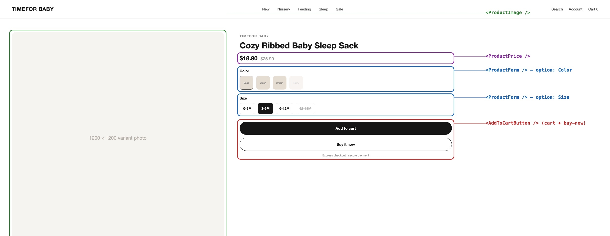

# Hydrogen Product Display

The product detail page (PDP) renders a single product's gallery, price, and
Color/Size selectors, and lets a shopper add the selected variant to their
cart. Every option combination, its image, and its availability come straight
from Shopify — nothing here is a hand-maintained matrix.

This integration uses the storefront API (SFAPI) product query
(`selectedOrFirstAvailableVariant`, `options`, `adjacentVariants`) together
with Hydrogen's `getProductOptions` / `getAdjacentAndFirstAvailableVariants`
helpers to resolve, for the option values currently in the URL, which variant
is selected and which combinations actually exist and are in stock.

## Components Architecture



## Components

| File                                                                             | Description                                                                                                                                             |
| --------------------------------------------------------------------------------- | ---------------------------------------------------------------------------------------------------------------------------------------------------- |
| [`app/routes/products.$handle.jsx`](../../app/routes/products.$handle.jsx)       | Loads the product (critical data) plus variants/recommendations (deferred), computes the optimistic selected variant from the URL's option params, and renders the full-width description block below the gallery+buybox row. |
| [`app/components/ProductGallery.jsx`](../../app/components/ProductGallery.jsx)   | Main image + clickable thumbnail strip (carousel) over the product's full image set; snaps back to the selected variant's photo on a Color change.    |
| [`app/components/ProductImage.jsx`](../../app/components/ProductImage.jsx)       | The single-image renderer `ProductGallery` wraps for the main photo.                                                                                    |
| [`app/components/ProductPrice.jsx`](../../app/components/ProductPrice.jsx)       | Renders the selected variant's price, with a struck-through `compareAtPrice` when the product is on sale.                                              |
| [`app/components/ProductForm.jsx`](../../app/components/ProductForm.jsx)         | Renders one button group per product option (Color as image swatches, Size as plain text), the "Size Guide" popup trigger next to the Size label, and the Add to cart / Buy it now buttons. |
| [`app/components/SizeGuide.jsx`](../../app/components/SizeGuide.jsx)             | "Size Guide" button + modal — a **static, universal** Height/Weight/Chest/Waist/Hip chart with a CM↔Inches toggle, same on every product (not sourced from CJ per-product — see note below). |
| [`app/components/AddToCartButton.jsx`](../../app/components/AddToCartButton.jsx) | Submits the selected variant's `merchandiseId` to Shopify's cart via `CartForm` (`LinesAdd`).                                                            |
| [`app/lib/variants.js`](../../app/lib/variants.js)                               | Builds the `?Color=...&Size=...` URL for a given option selection so links/back-forward stay shareable and SEO-friendly.                                |

## Instructions

### 1. Resolve the selected variant from the URL

`products.$handle.jsx` reads the `q` params via `getSelectedProductOptions`
and asks Shopify for `selectedOrFirstAvailableVariant`. Hydrogen's
`useOptimisticVariant` then makes the click feel instant — the UI updates
before the network round trip resolving the new URL finishes.

### 2. Color gets image swatches; Size is always plain text

`ProductForm.jsx` maps `getProductOptions(product)` to one button per option
value. Each value carries `exists`, `available`, `selected`, and
`firstSelectableVariant` — Hydrogen computes these from the product's real
variant list, so "is Navy in stock in size 3-6M" is never something this repo
decides on its own.

```jsx
// app/components/ProductForm.jsx
const isColorOption = option.name.toLowerCase() === 'color';
const variantImage = isColorOption ? firstSelectableVariant?.image?.url : undefined;

<button
  type="button"
  style={{
    border: selected ? '1px solid black' : '1px solid transparent',
    opacity: available ? 1 : 0.3,
  }}
  disabled={!exists}
  onClick={() => {
    if (!selected) {
      void navigate(`?${variantUriQuery}`, {replace: true, preventScrollReset: true});
    }
  }}
>
  <ProductOptionSwatch swatch={swatch} name={name} image={variantImage} />
</button>
```

`ProductOptionSwatch` prefers a native Shopify swatch image, and falls back
to that option value's own variant photo — so a "Sage" color button shows the
actual sage-colored product photo (CJ-style thumbnail). **Only Color gets
this treatment** — `variantImage` is `undefined` for every other option, so
Size (or any other axis) always renders as a plain text label (`ProductOptionSwatch`
falls through to `<span className="tob-swatch-text">{name}</span>` when it
has neither an image nor a native swatch color). A picture of the same
product in a different color tells a shopper something; a picture for
"3-6M" vs "6-12M" does not — showing text there was a real, since-fixed bug.

### 2b. Size Guide popup — one static chart for every product

Next to the "Size" label, `<SizeGuide />` renders a button that opens a modal
with a universal Height/Weight/Chest/Waist/Hip table (10 bands, Newborn→2-3Y)
and a CM↔Inches toggle (converted client-side in `SizeGuide.jsx`, no network
call). This is **intentionally the same content on every product** — CJ
doesn't provide chest/waist/hip measurements per listing, only height/age
sometimes, and inconsistent per-product data would be worse than one clear
universal reference (owner decision, 2026-07-07).

An earlier version of this sourced a **per-product** `custom.size_guide`
Shopify metafield (CJ's own height↔age text, written by `cj_add_product`) and
rendered just that product's data. That plumbing is still in `cj_add_product`
(harmless, unused) but the UI no longer reads it — `SizeGuide` takes no
props now. If a future request wants per-product data again, the metafield
write already exists; only the frontend needs to change back. Two gotchas
from building that first version, still relevant if you revive it:
- A newly-created metafield is **invisible to the Storefront API** until a
  `MetafieldDefinition` exists for it with `access.storefront: PUBLIC_READ` —
  writing the value alone isn't enough, and it can take ~20s to propagate
  after the definition + first value both exist.
- CJ's raw size text comes in at least two different phrasings ("6m/59cm" vs
  "Size 59 (1-3 months)") — `_parse_height_age_map` in `sourcing.py` handles
  both; a description that doesn't match either silently returns `{}`.

### 3. The gallery: carousel, not sticky, snaps to the selected color

`ProductGallery.jsx` renders the main image (via `ProductImage.jsx`) plus a
thumbnail strip over the product's full `images` set (fetched via the
`images(first: 10)` field added to the product GraphQL query). Clicking any
thumbnail sets local state and swaps the main image — that's the actual
carousel/"move between images" behavior. Its `useEffect` on
`selectedVariantImage?.id` means a **Color** change (from step 2) always
snaps the gallery back to that variant's own photo, even if a shopper had
been browsing a different thumbnail — so color selection and manual gallery
browsing never fight each other.

The gallery column is plain `align-self: start` in `app/styles/app.css`, not
`position: sticky` — it used to be sticky (scrolled with you down the page)
in two separate, duplicate `.tobp-gallery` CSS rules; both were removed
2026-07-07. If a future redesign wants sticky back, it needs to change both
occurrences of the `.tobp-gallery` selector in `app.css` (search for it — the
file has two full `PRODUCT PAGE (.tobp)` sections and CSS cascade means the
later one in the file wins on any property they both set).

Size/Color selection changes the URL's `?Color=...&Size=...` params on the
same route (re-running the loader, which resolves a new
`selectedOrFirstAvailableVariant`), or, for combined-listing variants that
live on a different Shopify product, navigates via a real `<Link>` so it
stays crawlable.

### 3a. The description is a full-width block below everything, not a narrow column

`products.$handle.jsx` renders `descriptionHtml` as a sibling of the
gallery+buybox grid (`grid-column: 1/-1` in `.tobp-desc`), so it spans the
full page width below both columns with its own top border — not squeezed
into the narrow right-hand column next to the gallery. If a
product's description looks cramped or narrow, check that div is still
outside `.product-main` in the JSX, not that the CSS broke.

**If broken tiny images show up inside the description text itself** (not
the gallery/thumbnails) — that's not a Hydrogen bug. CJ's raw supplier
description embeds its own `` thumbnail strip pointing at CJ's own asset
host, which isn't proxied through Shopify and renders broken. That gets
stripped at upload time by `_clean_supplier_description()` in
`src/org/agent_loop.py` — see
[`docs/PRODUCT_UPLOAD_PIPELINE.md`](../../docs/PRODUCT_UPLOAD_PIPELINE.md) §2.4.
If you see this on a live product, the description was uploaded before that
fix (2026-07-07) or the fix regressed — re-run the cleanup against that
product's `descriptionHtml`, don't patch it in this app.

### 4. Disable out-of-stock combinations

A value with `exists: false` (no such combination in Shopify's variant list)
gets `disabled` on the button itself — the click handler never fires, and
`aria-disabled` semantics come for free from the native `disabled` attribute.
A value with `exists: true` but `available: false` (a real but currently
sold-out combination) is still selectable — so a shopper can see the variant
exists — but is dimmed to `opacity: 0.3` and the Add to cart button below
disables once that combination is selected:

```jsx
// app/components/ProductForm.jsx
<AddToCartButton
  disabled={!selectedVariant || !selectedVariant.availableForSale}
  lines={selectedVariant ? [{merchandiseId: selectedVariant.id, quantity: 1, selectedVariant}] : []}
>
  {selectedVariant?.availableForSale ? 'Add to cart' : 'Sold out'}
</AddToCartButton>
```

**This "sold out" state only ever appears for a variant Shopify itself marks
unavailable** — which today means a variant with *tracked* inventory at zero.
Products created via `cj_add_product` (see the pipeline doc) currently leave
every real variant untracked (`inventory_management: null`), so
`availableForSale` is always `true` for them regardless of any quantity
number — there is no "sold out" state to see on a Sol-created product today.
That's a deliberate, documented gap in the upload pipeline, not something to
patch here in `ProductForm.jsx`.

### 5. Add to cart goes straight to Shopify — no separate backend check needed

`AddToCartButton.jsx` submits `merchandiseId` through Hydrogen's `CartForm`
using the Storefront API's native `LinesAdd` action — a real request to
Shopify's own cart service, not a custom endpoint in this app. That means a
shopper stripping the `disabled` attribute in devtools and submitting an
out-of-stock `merchandiseId` anyway still hits Shopify's own inventory check
on `CartLinesAdd`, which rejects it. Don't add a second, hand-rolled
availability check in this codebase to "double-protect" checkout — it would
duplicate a guarantee Shopify already enforces, and a hand-rolled copy is the
thing that could actually drift out of sync with real inventory.

## Additional Notes

### Where do the ≥3 images per product come from?

The image count and quality are enforced upstream, at publish time, not by
this app. See [`docs/PRODUCT_UPLOAD_PIPELINE.md`](../../docs/PRODUCT_UPLOAD_PIPELINE.md)
for the CJ→Shopify sourcing pipeline that vets and gates images before a
product is ever created — the storefront just renders whatever the pipeline
already published.

### How do I add a new option type (e.g. Material)?

Nothing in `ProductForm.jsx` is Color/Size-specific — it iterates
`productOptions` generically. Adding a new Shopify product option (e.g.
Material) with its own values makes it show up as another button group
automatically, including image swatches if that option's values have
variant images.

### How do I change what counts as "sold out" vs. "doesn't exist"?

That distinction is Shopify's `adjacentVariants` / `availableForSale` data,
surfaced via `exists` / `available` on each option value — not something to
special-case in this component. If a combination is showing the wrong state,
check the variant's inventory policy and stock level in Shopify admin first.
